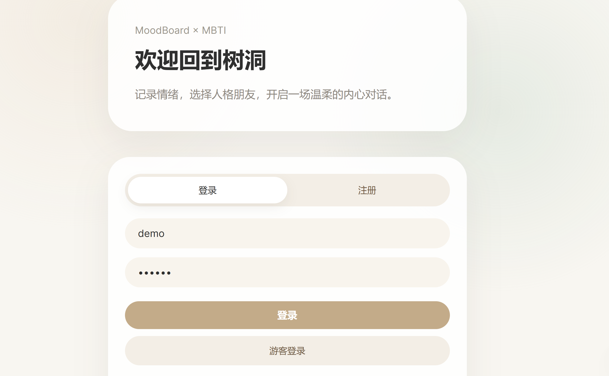
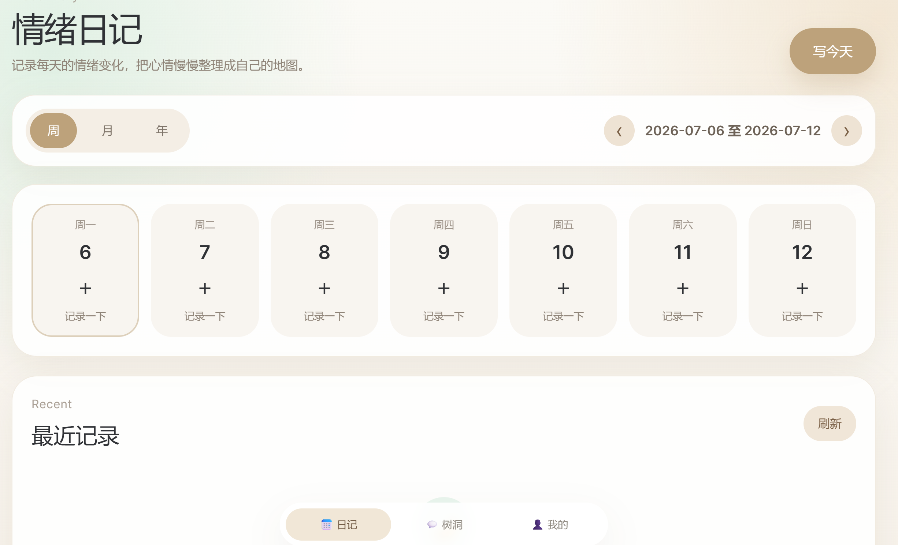
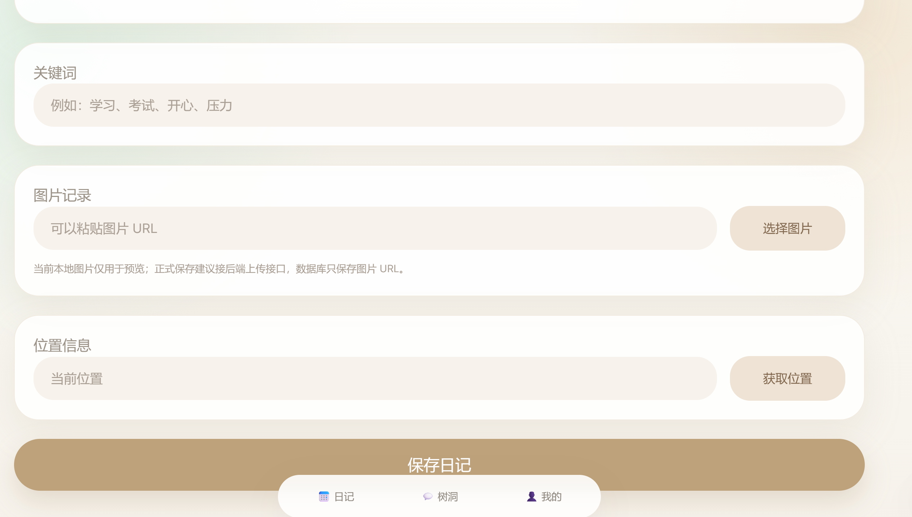
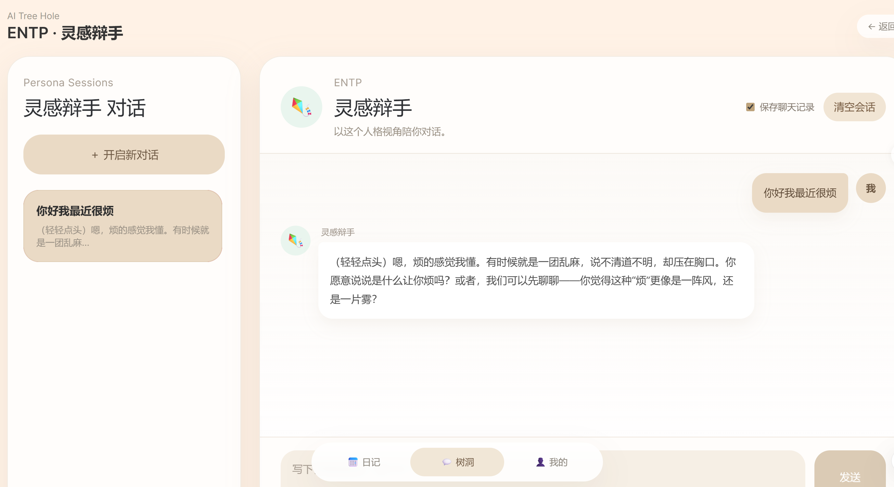
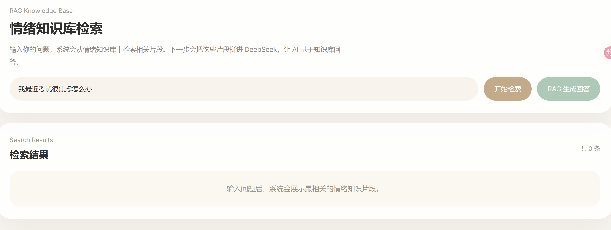
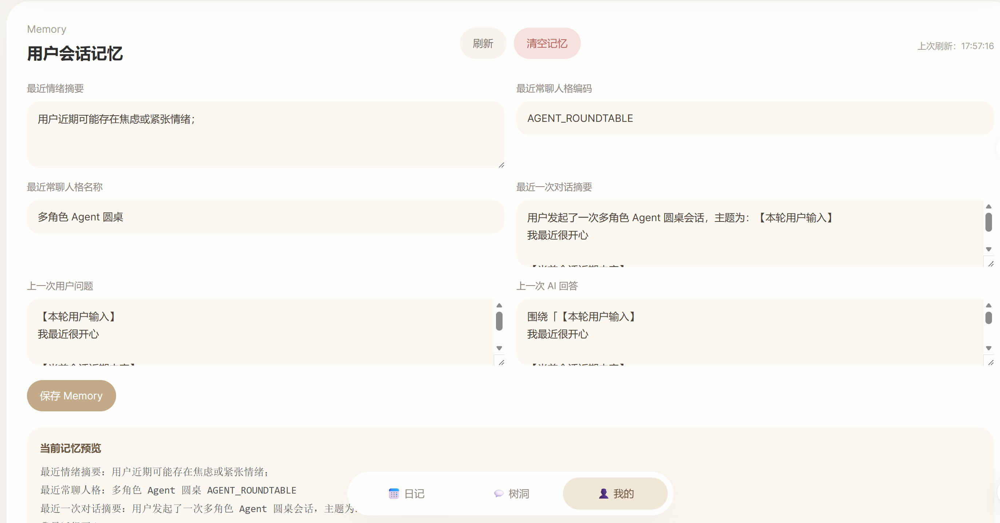
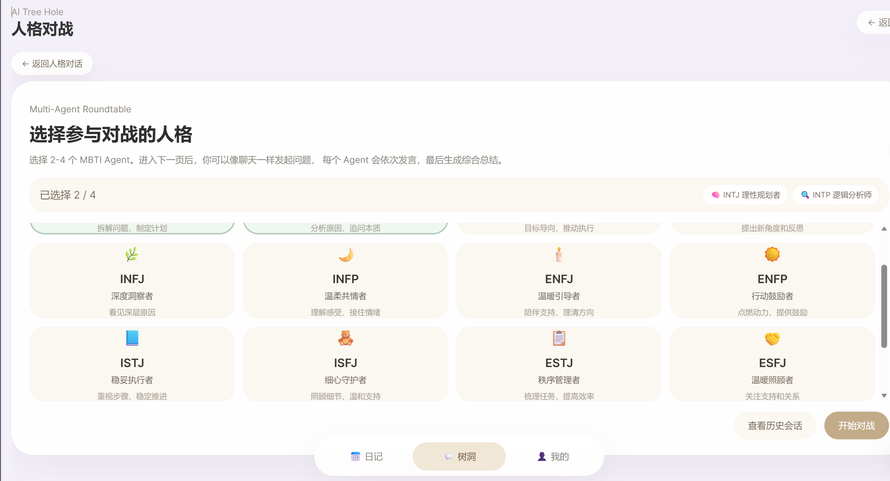

# AI 情绪树洞与多 Agent 交互系统

## 一、项目简介

是一个基于 **Vue3 + TypeScript + Spring Boot + DeepSeek API** 的 AI 情绪日记与人格互动系统。

项目围绕“情绪记录、AI 树洞、MBTI 人格陪伴、多角色 Agent 对话”展开，支持用户记录每日情绪、与 AI 进行日常树洞聊天、切换不同 MBTI 人格进行对话，并实现了 RAG 情绪知识库、Memory 用户记忆、Tool Calling 位置工具调用、多角色 Agent 圆桌会话等 AI 应用能力。

围绕功能测试、接口测试、数据库一致性测试、异常测试、AI 对话质量测试等方向进行设计与验证。

---

## 二、技术栈

### 前端

```text
Vue3
TypeScript
Vite
Vue Router
Axios
Tailwind CSS
HTML / CSS
LocalStorage
```

### 后端

```text
Spring Boot 3
Java 17
Spring Data JPA
H2 / MySQL
RESTful API
Java HttpClient
DeepSeek API
高德地图 API
```

### 测试与工具

```text
Postman
浏览器 DevTools
H2 Console
SQL
Git / GitHub
```

---

## 三、核心功能

### 1. 情绪日记

- 支持每日情绪 emoji 记录
- 支持文字日记、图片上传、拍照记录
- 支持位置记录
- 支持周 / 月 / 年视图
- 支持情绪趋势与图谱展示

### 2. AI 日常树洞

- 用户可以在日常树洞中输入情绪困扰
- 后端调用 DeepSeek API 生成回复
- 支持 Mock / Real 模式切换
- 支持保存聊天记录
- 支持清空会话

### 3. MBTI 人格聊天

- 支持 16 种 MBTI 人格
- 不同人格使用不同 Prompt 风格
- 支持单人格 AI 聊天
- 支持人格切换
- 支持结合用户 Memory 进行连续化回答

### 4. 人格面具

- 支持用户自定义 AI 人格
- 可基于 MBTI 类型扩展专属 Prompt
- 支持保存和复用自定义人格

### 5. 心灵盲盒

- 随机抽取人格和话题
- 生成轻量化情绪陪伴对话
- 适合测试随机推荐与 AI 回复流程

### 6. RAG 情绪知识库

- 设计 `knowledge_chunk` 知识片段表
- 系统初始化情绪调节类知识
- 支持关键词 / 相似度检索 TopK 知识片段
- 将知识片段拼接进 Prompt
- 调用 DeepSeek 生成知识增强回答

### 7. Memory 用户记忆

- 设计 `user_memory` 用户记忆表
- 保存用户最近情绪摘要
- 保存最近常聊人格
- 保存最近一次用户问题和 AI 回答
- 下一轮聊天自动读取 Memory 并拼接进 Prompt

### 8. Tool Calling 位置工具

- 前端通过浏览器 Geolocation 获取经纬度
- 后端调用高德逆地理编码接口
- 返回省、市、区、详细地址
- 在前端展示工具名称、调用参数和调用结果
- 模拟 AI Agent 工具调用流程

### 9. 多角色 Agent 圆桌会话

- 支持选择 2-4 个 MBTI Agent
- 第一个页面只负责选择参与人格
- 第二个页面进入类似微信的会话界面
- 左侧为历史会话栏
- 右侧为聊天区
- 用户输入后，多个 Agent 依次发言
- 最后生成综合总结
- 支持历史会话切换、删除和本地持久化

---

## 四、项目截图

### 登录页



### 情绪日记首页



### 日常树洞聊天



### MBTI 人格聊天



### RAG 情绪知识库



### Memory 用户记忆



### 多角色 Agent 圆桌会话



---

## 五、项目亮点

### 1. AI 应用能力完整

项目不仅调用大模型 API，还进一步实现了：

```text
RAG 检索增强生成
Memory 用户长期记忆
Tool Calling 工具调用
多角色 Agent 编排
多轮对话管理
```

### 2. 多角色 Agent 编排

将传统“多人格对战”升级为“多角色 Agent 圆桌会话”。

用户选择 2-4 个 MBTI Agent 后，系统按照 Agent 队列依次调用大模型接口，每个 Agent 基于独立人格设定、用户长期记忆和当前问题生成不同视角回复，最后输出综合总结。

### 3. Memory 连续化对话

系统在用户聊天后自动提取情绪关键词，并写入 `user_memory` 表。下一轮 AI 回复时，后端会自动读取用户最近情绪、最近问题、常聊人格等信息，使 AI 回复具备上下文延续能力。

### 4. RAG 情绪知识库

项目内置情绪调节类知识片段，后端根据用户问题检索相关知识，并将检索结果拼接到大模型 Prompt 中，实现基于知识库的增强回答。

### 5. Tool Calling 工具调用

将高德位置逆地理编码封装成工具调用流程，前端获取经纬度，后端调用外部 API，前端展示工具名称、输入参数和返回结果，用于模拟 Agent 工具调用能力。

### 6. 适合测试岗位展示

项目覆盖多个测试场景：

```text
登录注册测试
日记 CRUD 测试
AI 聊天测试
RAG 检索测试
Memory 更新测试
Tool Calling 测试
多 Agent 编排测试
接口异常测试
数据库一致性测试
前后端联调测试
```

---

## 六、项目启动方式

### 1. 启动后端

进入后端目录：

```bash
cd backend
mvn spring-boot:run
```

后端默认地址：

```text
http://localhost:8888
```

H2 控制台：

```text
http://localhost:8888/h2-console
```

H2 默认配置：

```text
JDBC URL: jdbc:h2:file:./data/moodboard;MODE=MySQL;DATABASE_TO_LOWER=TRUE;CASE_INSENSITIVE_IDENTIFIERS=TRUE
User Name: sa
Password: 留空
```

### 2. 启动前端

进入前端目录：

```bash
cd frontend
npm install
npm run dev
```

前端默认地址：

```text
http://localhost:5173
```

---

## 七、DeepSeek 与高德 API 配置

项目默认支持 Mock 模式，不配置 API Key 也可以运行基础功能。

### Windows PowerShell 示例

```powershell
$env:AI_MODE="real"
$env:DEEPSEEK_API_KEY="your_deepseek_api_key"
$env:AI_CHAT_URL="https://api.deepseek.com/chat/completions"
$env:AI_MODEL="deepseek-chat"
$env:AMAP_KEY="your_amap_web_service_key"

cd backend
mvn spring-boot:run
```

### application.yml 

```yml
ai:
  mode: ${AI_MODE:mock}
  chat-url: ${AI_CHAT_URL:https://api.deepseek.com/chat/completions}
  api-key: ${DEEPSEEK_API_KEY:${AI_API_KEY:}}
  model: ${AI_MODEL:deepseek-chat}
  temperature: ${AI_TEMPERATURE:0.7}
  timeout-seconds: ${AI_TIMEOUT_SECONDS:90}

amap:
  key: ${AMAP_KEY:}
```

---

## 八、核心接口

```text
POST /api/auth/register
POST /api/auth/login

GET  /api/user/profile
POST /api/user/profile

POST /api/diaries
GET  /api/diaries/week
GET  /api/diaries/month
GET  /api/diaries/year
GET  /api/diaries/search

POST /api/ai/chat/send
POST /api/ai/memory-chat/send

GET  /api/knowledge/search
GET  /api/knowledge/ask

GET  /api/memory/current
POST /api/memory/update
POST /api/memory/clear

POST /api/ai/tools/location/reverse
POST /api/ai/agent/roundtable

GET  /api/custom-personas
POST /api/custom-personas

POST /api/blind-box/draw
POST /api/blind-box/start
POST /api/blind-box/reply
```

---

## 九、测试说明

本项目围绕软件测试岗位进行了测试实践，主要包括：

### 1. 功能测试

```text
登录注册
游客登录
情绪日记保存
图片上传
位置记录
日常树洞聊天
MBTI 人格聊天
人格面具
心灵盲盒
RAG 知识库问答
Memory 用户记忆
Tool Calling 位置工具
多角色 Agent 圆桌会话
```

### 2. 接口测试

使用 Postman 对核心接口进行测试，覆盖：

```text
正常参数
空参数
非法参数
未登录访问
错误 Token
AI 接口异常
外部 API Key 为空
DeepSeek 返回为空
接口超时
```

### 3. 数据库验证

使用 H2 Console 验证：

```text
emotion_diary
chat_message
knowledge_chunk
user_memory
custom_persona
persona_battle_session
persona_battle_message
```

### 4. 典型缺陷案例

```text
1. RAG 回答接口 500
原因：DeepSeek real 配置异常。
处理：后端增加 try-catch 兜底，并支持 mock 模式返回。

2. Memory Chat 请求 content 为空
原因：前端传参变量错误。
处理：修正 ChatWorkspace.vue 中发送参数。

3. 人格对战页面显示不完整
原因：选择人格区域与聊天区域混在同一页面。
处理：拆分为“人格选择页”和“会话聊天页”。

4. 16 人格展示不全
原因：前端 agentOptions 只配置了 8 个。
处理：补充完整 16 种 MBTI，并为中间区域增加独立滚动。
```

---

---

## 十一、目录结构

```text
MoodBoard-Complete
├─ backend
│  ├─ src/main/java/com/moodboard
│  │  ├─ controller
│  │  ├─ service
│  │  ├─ entity
│  │  └─ repository
│  └─ src/main/resources/application.yml
│
├─ frontend
│  ├─ src
│  │  ├─ api
│  │  ├─ components
│  │  ├─ pages
│  │  ├─ router.ts
│  │  └─ main.ts
│  └─ package.json
│
├─ docs
│  ├─ image
│  ├─ screenshots.md
│  ├─ 01-测试计划.md
│  ├─ 02-功能测试用例表.xlsx
│  ├─ 03_Bug记录表.xlsx
│  ├─ 04-测试总结.md
│  └─ 05-接口测试记录.md
│
├─ tests
├─ README.md
├─ .gitignore
└─ .env.example
```

---

## 十二、注意事项

```text
1. 本项目不上传真实 DeepSeek API Key。
2. 本项目不上传真实高德 API Key。
3. node_modules、target、dist、H2 数据库文件不纳入 Git。
4. 本地运行前需要先启动后端，再启动前端。
5. DeepSeek Real 模式需要自行配置环境变量。
```