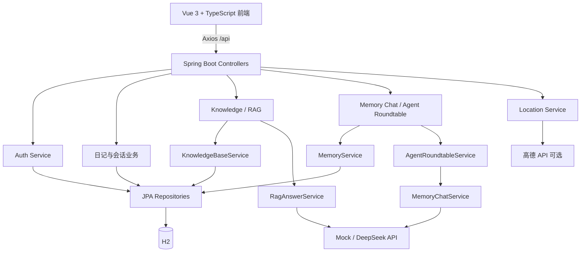
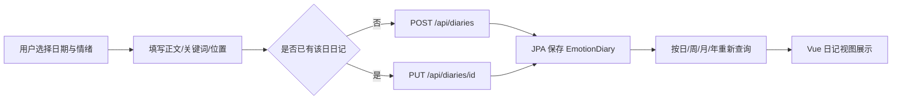
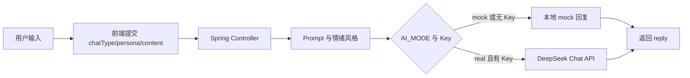
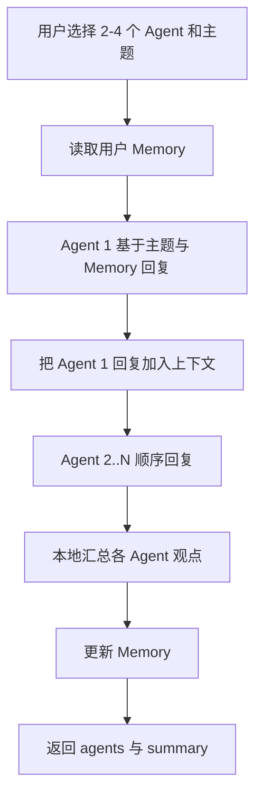
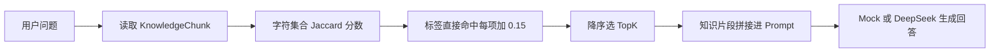
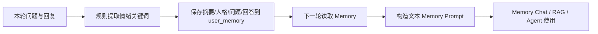

# 1 项目名称

MoodBoard：情绪日记与多角色 AI 互动系统。

# 2 项目背景

学生和年轻用户在面对学习压力、拖延、睡眠和人际关系问题时，往往需要一个低门槛的记录与梳理工具。MoodBoard 将结构化情绪日记、轻量知识检索和不同 MBTI 视角的 AI 对话放在同一个 Web 应用中，帮助用户记录状态、回看变化并获得可执行建议。

# 3 项目目标

- 提供可按日、周、月、年管理的情绪日记。
- 提供默认可离线演示的 mock AI 对话。
- 在可选 real 模式下调用 DeepSeek 兼容 Chat API。
- 用轻量 RAG、用户 Memory 和顺序多 Agent 展示 AI 应用组合方式。
- 建立可重复运行的前端构建、后端集成测试和 API 自动化基线。

# 4 技术栈

| 层级 | 技术 | 作用 |
| --- | --- | --- |
| 前端 | Vue 3、TypeScript、Vite | 页面、状态和生产构建 |
| 路由与请求 | Vue Router、Axios | 页面路由、REST 请求、Authorization 头 |
| 后端 | Java 17、Spring Boot 3.3.5 | REST API 与业务编排 |
| 持久化 | Spring Data JPA、H2 | Entity/Repository 和本地文件数据库 |
| AI | Java HttpClient、DeepSeek 兼容接口、mock | 对话生成与无 Key 演示 |
| RAG | 字符 Jaccard、标签加权、TopK | 无向量数据库的知识片段排序 |
| 测试 | JUnit 5、MockMvc、pytest、requests、vue-tsc | 集成、HTTP API 和构建验证 |

# 4.1 团队信息与开发过程

项目由 3 名成员在 1 个月内协作完成，按第 1 周至第 4 周推进。潘子彤担任组长，主要负责后端开发与项目统筹；安姣凝主要负责 Vue 前端开发和页面交互；张越主要负责 AI 对话、Multi-Agent、轻量 RAG 与 Memory。三名成员共同参与需求分析、架构和 API 约定、阶段联调、测试验收、Bug 修复确认、项目总结及答辩准备。

第 1 周完成需求分析、功能划分、技术选型和架构设计；第 2 周完成 Vue 与 Spring Boot 基础工程、用户和情绪日记功能及首次联调；第 3 周完成 AI 对话、Multi-Agent、RAG、Memory 和第二轮系统联调；第 4 周完成自动化测试、浏览器人工验收、Bug 回归、安全检查、提交包整理及报告答辩准备。详细事实材料见 `docs/report-project-info.md`。

# 5 系统架构

# 6 功能模块

- 注册、登录、游客流程和用户资料。
- 情绪日记新增、读取、修改、删除及周/月/年展示。
- 日常树洞、单人格聊天、漂流瓶和心灵盲盒。
- 自定义人格面具。
- 情绪知识库检索与 RAG 回答。
- 用户 Memory 查看、更新、清空和对话注入。
- 2–4 个 Agent 顺序协作与综合总结。
- 浏览器定位和可选高德逆地理编码。
- 广场帖子后端查询/发布接口；当前活动前端未接入。

# 7 核心业务流程

## 情绪日记流程

## AI 对话流程

## 多 Agent 圆桌流程

## RAG 查询流程

## Memory 记忆流程

# 8 项目亮点

- 完整的 Vue/Spring Boot REST 前后端结构。
- 日记日、周、月、年多时间维度管理。
- mock/real AI 双模式，默认无需 Key 即可演示。
- 无额外基础设施依赖的轻量 RAG。
- JPA 持久化 Memory 与 Prompt 注入。
- 前序回复传给后续角色的顺序多 Agent 协作。
- JUnit、pytest 和前端 production build 的真实验证记录。

# 9 核心技术实现

## REST API

Controller 使用 `/api` 路径提供 JSON 接口，响应主要采用 `{ code, message, data }`。Axios 拦截器从 localStorage 读取 token 并放入 Authorization 请求头。详细映射见 `docs/api-audit.md`。

## Vue 与 Spring Boot 前后端交互

Vite 开发服务器把 `/api` 代理到 8888 端口。页面和组件通过 `frontend/src/api/index.ts` 调用后端，并读取统一响应中的 `data`。

## JPA 数据持久化

Entity 对应 H2 表，Repository 基于 Spring Data JPA。日记按 `userId` 和 `diaryDate` 查询；周、月、年查询复用日期区间 Repository 方法。测试使用独立内存 H2，不操作业务数据库。

## AI Service

`AiService` 根据 `AI_MODE` 和 API Key 决定使用本地 mock 或 Java HttpClient 调用外部 Chat API。Memory Chat 和 RAG 服务也在 real 调用失败时回退，便于课程演示。

## RAG

`TextSimilarityUtil` 把中文文本清理后转成字符集合，计算交集/并集的 Jaccard 相似度。`KnowledgeBaseService` 对查询中直接出现的标签每项增加 0.15，分数最高不超过 1.0，再排序截取 TopK。当前没有 Embedding、向量索引或向量数据库。

## Memory

`UserMemory` 保存 `recentEmotionSummary`、`recentPersonaCode`、`recentPersonaName`、`chatSummary`、`lastQuestion`、`lastAnswer` 及时间字段。`MemoryService` 用有限规则提取焦虑、拖延、睡眠、低落和考试等关键词，再把字段拼成文本 Prompt。

## Multi-Agent

`AgentRoundtableService` 依次遍历 Agent 列表。每次调用都携带主题、Memory 和此前 Agent 的回复；返回后追加到会话上下文。所有角色结束后，本地代码从每条回复提取摘要并更新 Memory。

# 10 测试与质量保障

- `npm run build`：成功。
- `mvn test`：成功，1 个日记生命周期集成测试通过。
- `mvn package`：成功。
- pytest API：13 passed。
- 功能测试表：88 条，已执行 24、通过 23、失败 1、未执行 64；已执行通过率 95.8%。
- Bug：14 条，已关闭 10、已修复 3、待回归 1、待修复 0。
- 日记删除和多人格圆桌问题输入已完成人工回归并通过；BUG-012、BUG-014 已关闭。

# 11 已知不足

- H2 适合本地课程项目，不是生产部署数据库。
- 登录 token 只保存在进程内存中，密码未做生产级哈希。
- 图片只生成浏览器本地预览，没有上传和持久化接口。
- RAG 只做字符相似度和标签加权，语义召回能力有限。
- real AI 和真实高德依赖外部 API、网络和用户 Key。
- 活动前端圆桌会话主要使用 localStorage，后端对战会话 API 未被该页面调用。
- 大部分浏览器、移动端和第三方服务用例尚未人工执行。

## 最终版本状态

- 前端构建通过。
- 后端测试通过。
- 后端打包通过。
- pytest 通过。
- 核心浏览器人工验收完成。
- 已知限制：real DeepSeek 仍需外部 Key；图片没有后端上传接口；H2 为课程项目数据库；RAG 为 Jaccard + 标签加权 + TopK；仍有低优先级测试未执行。
- 最终冻结日期：2026-09-13。

# 12 后续优化方向

- 在课程范围允许时改进密码哈希和持久化会话认证。
- 为图片增加上传接口、大小限制和存储管理。
- 在数据规模需要时评估 Embedding 与向量检索。
- 统一活动前端圆桌与后端会话持久化接口。
- 增加浏览器端回归测试，但应先完成当前人工验收基线。
- 为 real AI 与高德配置建立隔离的测试环境和安全 Key 管理。
